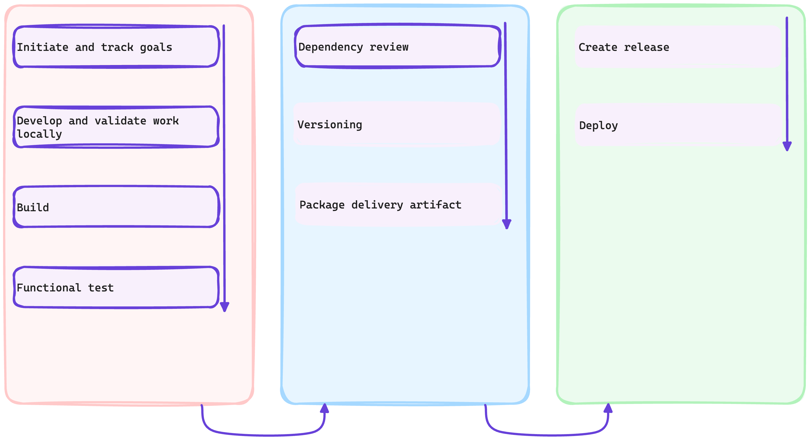

# :test_tube: Dependency Review

<!-- markdownlint-disable MD033 MD046 -->

!!! quote ":octicons-milestone-16: Add Security Checks"

    > Dependency review helps you understand dependency changes and the security impact of these changes at every pull request. It provides an easily understandable visualization of dependency changes with a rich diff on the "Files Changed" tab of a pull request. Dependency review informs you of:

    > - Which dependencies were added, removed, or updated, along with the release dates.
    > - How many projects use these components.
    > - Vulnerability data for these dependencies.

    

---

## Exercise: Automate Enforcement of Dependency Review

---

### **:material-numeric-1-circle: Understand the Dependency Review Configurations**

```yaml title=".github/dependency-review-config.yml"
fail-on-severity: moderate #(1)!

comment-summary-in-pr: always #(2)!

allow-licenses: #(3)!
  - MIT
  - GPL-3.0
  - BSD-3-Clause

deny-licenses: #(4)!
  - LGPL-2.0
  - BSD-2-Clause

allow-ghsas: #(5)!
  - GHSA-abcd-1234-5679
  - GHSA-efgh-1234-5679

fail-on-scopes: #(6)!
  - development
  - runtime
  - unknown
```

1. Possible values: "critical", "high", "moderate", "low"
2. Post summary as a comment to respective pull request
3. Only allow the listed licenses (optional). Possible values: Any `spdx_id` value(s) from https://docs.github.com/en/rest/licenses
4. Block the pull request on these licenses (optional). Possible values: Any  `spdx_id` value(s) from https://docs.github.com/en/rest/licenses

    :warning: You can only include one of either of these two options: `allow-licenses` and `deny-licenses`.

5. Skip these GitHub Advisory Database IDs during detection (optional). Possible values: Any valid GitHub Advisory Database ID from https://github.com/advisories
6. Block pull requests that introduce vulnerabilities in the scopes that match this list (optional). Possible values: "development", "runtime", "unknown"

---

### **:material-numeric-2-circle: Implement Dependency Review Check**

Open the `.github/workflows/continuous.integration.yml` file in the editor and add the {== highlighted ==} content as follows:

```yaml title=".github/workflows/continuous.integration.yml" linenums="1" hl_lines="58-67"
--8<-- "reference.implementations/workflows/1.2.continuous.integration.yml"
```

---

### **:material-numeric-2-circle: Commit and publish your changes**

Pushing your changes will apply the check on the existing pull request.

!!! tip "You can link your changes to an issue"

    Recall the issue you created earlier and its respective issue number, you will use it to link your current changes to the issue.

```bash linenums="1"
git add .
git commit -m "$(printf 'Create a tetris game to drive site engagement\n\n-Add dependency review as a security check\n\n- Resolves #<ISSUE-NUMBER>')"
git push origin feature/tetris-game
```

{==

When you navigate to the repository on GitHub and open the existing pull request, you can confirm that the check was executed. As there are no compliance violations currently in the PR, the check is successful.


==}

!!! question "Homework"

    Can you attempt to make the dependency review check to fail?

---

## 📚 Resources

- [Understanding your software supply chain](https://docs.github.com/en/code-security/supply-chain-security/understanding-your-software-supply-chain)
- [GitHub Advanced Security - Dependency Graph](https://docs.github.com/en/code-security/supply-chain-security/understanding-your-software-supply-chain/about-the-dependency-graph)
