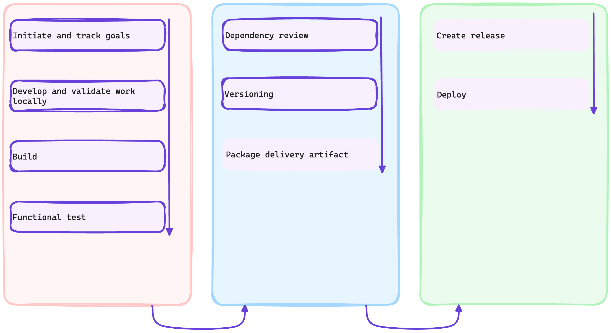

# :test_tube: Versioning

<!-- markdownlint-disable MD046 -->

!!! quote ":octicons-milestone-16: Motivation for Versions"

    > A pull request represents a single aggregation of multiple significant changes (i.e. commits). When collaborating at scale in a large team or project, pull requests targeting the default (production) branch can be further buffered through a merge queue for further validation. In either cases, it is imperative to keep track of the aggregated changes introduced into the default branch which serves as the basic source of production releases.
    >
    > Some versions may eventually be released whereas others are not. Moreover, a released version may be rolled back to an earlier release as business decisions evolve.

    

---

## Exercise: Version Changes Added to the Main Branch

Semantic Versioning, `semver` is a scheme that conveys meaning about the underlying code and what has been modified from one version to the next.

`semver` version `2.0.0` is officially summarized as follows.

> Given a version number MAJOR.MINOR.PATCH, increment the:
>
> 1. MAJOR version when you make incompatible API changes
> 1. MINOR version when you add functionality in a backward compatible manner
> 1. PATCH version when you make backward compatible bug fixes
>
> Additional labels for pre-release and build metadata are available as extensions to the MAJOR.MINOR.PATCH format.

At this fundamentals phase of DevSecOps implementation, we will apply the `semver` scheme and automate patch increment. There are conventions that can be adopted to equally automate increment in `MAJOR` and `MINOR` versions, but for simplicity our intended implementation assumes the understanding that `MAJOR` and `MINOR` version bumps will be manually initiated.

---

### **:material-numeric-1-circle: Implement `PATCH` Versioning**

In the file explorer, create a new workflow `.github/workflows/continuous.versioning.yml` as follows.

```yaml title=".github/workflows/continuous.versioning.yml" linenums="1" hl_lines="4-6 13-17 25-31 33-47 49-60"
--8<-- "reference.implementations/workflows/2.1.continuous.delivery.yml"
```

---

#### Analysis

- **Lines `4 - 6`**

    We are introduced to a new event that encapsulates the activity of pushing to particular branches, specifically the `main` branch alone in this implementation.

- **Lines `13 - 17`**

    A GitHub App will be used as the actor for the operations we shall be executing. Hence the `actions/create-github-app-token@v1` action is used here to generate an authorization token for the app.

    !!! question "What is a GitHub App?"
        GitHub Apps, much _like_ `service accounts` and `bots`, are tools that extend GitHub's functionality. You can build a GitHub App to provide flexibility and reduce friction in your processes, {== without needing to sign in a user or create a service account ==}. GitHub Apps can do things on GitHub like open issues, comment on pull requests, and manage projects. They can also do things outside of GitHub based on events that happen on GitHub. For example, a GitHub App can post on Slack when an issue is opened on GitHub.

    The GitHub App actor will later be used to checkout the repository's source code and to push tags.

- **Lines `25 - 31`**

    The step `Get last version number` computes the last version and writes it to the step output named `last_version`.

- **Lines `33 - 47`**

    The step `Get new version number` uses reads the output from the previous step by the expression `${{ steps.get_last_version.outputs.last_version }}`, and use it to compute the patch increment.

- **Lines `49 - 60`**

    The step `Create tag for the new version` creates a new `git` tag for release. A tag identifies specific points in a repository’s history as being important. Here, the tag is being used to mark a release point.

    Because a persisted app token exists and will be used in the tag push, we can be confident that the push will effectively trigger other relevant automation. On the other hand, if the default `GITHUB_TOKEN` was used it would not trigger a workflow as {== **GitHub Actions rightly guard against unintentional recursive triggering of workflows** ==}.

---

### **:material-numeric-2-circle: Commit and publish your changes**

!!! tip "You can link your changes to an issue"

    Recall the issue you created earlier and its respective issue number, you will use it to link your current changes to the issue.

```bash linenums="1"
git add .
git commit -m "$(printf 'Create a tetris game to drive site engagement\n\n-Implement automatic patch versioning\n\n- Resolves #<ISSUE-NUMBER>')"
git push origin feature/tetris-game
```

---

## 📚 Resources

- [Semantic Versioning 2.0.0](https://semver.org/)

---
